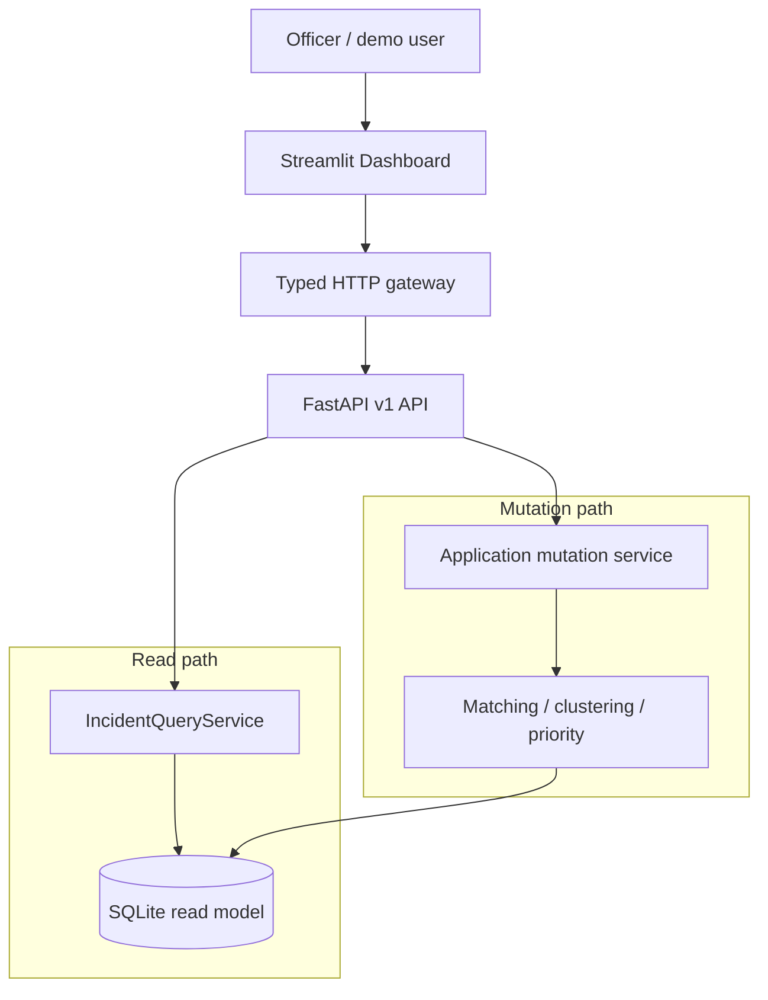

<div align="center">

# CivicPulse

### From scattered civic complaints to explainable incident intelligence.

A local-first civic incident intelligence prototype that can run offline after its dependencies and embedding model are prewarmed.

**Python 3.12** · **FastAPI** · **SQLite** · **Streamlit** · **Strict Pydantic contracts**

</div>

> **Demo status** — Phase 8 is complete. The repository contains a working API contract, typed Dashboard gateway, synthetic Shah Alam-inspired seed data, review resolution, deterministic reset, and regression coverage.

## Why CivicPulse?

Municipal teams rarely receive one clean report per incident. They receive overlapping messages in different languages, with inconsistent spelling, approximate locations, and different descriptions of the same problem.

CivicPulse turns that stream into an operational view:

```text
Submit complaint
→ normalize and compare evidence
→ auto_match / review_required / no_match
→ confirmed / isolated / conflict incident state
→ officer resolution when needed
→ incident snapshot and priority refresh
```

The important product decision is what CivicPulse refuses to pretend it knows:

| Layer | States | Operational meaning |
| --- | --- | --- |
| Relationship decision | `auto_match`, `review_required`, `no_match` | Pair-level matcher or officer outcome |
| Incident status | `confirmed`, `isolated`, `conflict` | Graph-level operational state |
| Operational priority | `low`, `medium`, `high`, `critical`, or unavailable | Policy output from confirmed evidence only |

Conflict incidents deliberately return `priority: null`; this is an explicit safety outcome, not missing computation. This keeps a likely duplicate from silently becoming a confirmed public-service incident.

## What the demo shows

The Dashboard presents a compact, synthetic municipal district modelled on urban patterns around Shah Alam, Selangor. It is deliberately not real municipal data.

### The synthetic district

The deterministic seed contains **120 complaints** arranged across five zones:

| Zone | Story in the demo |
| --- | --- |
| **Taman Seri Murni** | Residential rubbish, street-light, flooding, and pothole reports |
| **Seksyen Harmoni** | School-access drainage, pothole, street-light, and flooding reports |
| **Kawasan Perindustrian Maju** | Industrial-road damage, rubbish, lighting, and drainage reports |
| **Pusat Komersial Sentosa** | Commercial rubbish, pothole, drainage, and lighting reports |
| **Kampung Sungai Damai** | Low-lying-road flooding and downstream drainage reports |

The seed includes a small spatial narrative: an upstream drain problem near a school-access area and flooding on a downstream low-lying road. That structure gives the map a coherent civic story without pretending to be an official dataset. It is demonstration context, not a generated causal prediction.

> **Synthetic data notice** — All complaints, coordinates, zone names, and incident outcomes shown by this prototype are synthetic. The spatial layout is inspired by common Klang Valley urban patterns and must not be interpreted as live Shah Alam complaints.

### Dashboard workflow

1. **Operational queue** — Read API-ranked incidents with confirmed and pending counts kept separate.
2. **Incident detail** — Inspect complaint membership, accepted edges, candidate relationships, priority reasons, and conflict reasons.
3. **Hotspot map** — See confirmed incident centroids; pending candidates do not inflate hotspot intensity.
4. **Complaint submission** — Submit a new report through the API with a stable `Idempotency-Key` across Streamlit reruns.
5. **Review queue** — Read original matcher evidence, then approve or reject through the persistent review service.
6. **Safe demo reset** — Restore the server-configured seed only when the API feature flag and Dashboard setting are both enabled and the operator types `RESET DEMO`.

## Architecture



The architecture is intentionally split into two narrow paths: read endpoints query a read model, while mutations go through application orchestration before recalculating graph and priority state.

The Dashboard is an API client, not a second backend:

- routes validate, map, and translate errors;
- application services own mutation orchestration and transaction boundaries;
- read endpoints use `IncidentQueryService` to isolate the read model;
- sorting, matching, clustering, and priority rules stay server-owned;
- Streamlit does not import repositories, SQLite, backend services, or domain models;
- incident IDs are membership-derived **snapshot IDs**, not permanent case IDs.

## API surface

The API contract is versioned under `/api/v1` and protected by a deterministic OpenAPI snapshot at [`tests/contracts/openapi-v1.json`](tests/contracts/openapi-v1.json).

| Area | Endpoints |
| --- | --- |
| Health | `GET /api/v1/health/live`, `GET /api/v1/health/ready` |
| Incidents | `GET /api/v1/incidents`, `GET /api/v1/incidents/{incident_id}` |
| Complaints | `POST /api/v1/complaints` with required `Idempotency-Key` |
| Reviews | `GET /api/v1/reviews`, `GET /api/v1/reviews/{review_id}` |
| Review actions | `POST /api/v1/reviews/{review_id}/approve`, `POST /api/v1/reviews/{review_id}/reject` |
| Demo administration | `POST /api/v1/admin/reset`, disabled by default and bodyless |

Mutation responses expose previous and new snapshot IDs so clients can refresh without guessing which incident changed.

## Development setup

The repository currently contains the Dashboard client and injectable FastAPI boundary, but not a complete runtime composition entrypoint. The steps below prepare the environment and start the Dashboard client; the full browser demo requires a Phase 9 launcher that assembles the repository, embedding provider, application service, and seed state.

### 1. Install dependencies

PowerShell:

```powershell
# First-time setup; requires network access if the uv cache is empty
uv sync

# Subsequent cached setup; fully offline
uv sync --offline
```

The project targets Python `>=3.12,<3.13`.

### 2. Prewarm the local embedding model

```powershell
# First prewarm; requires network access if the model is not cached
uv run python -m scripts.prewarm_model

# Subsequent cached readiness check; fully offline
uv run --offline python -m scripts.prewarm_model
```

Use a different policy file only when intentionally changing the configured contract:

```powershell
uv run --offline python -m scripts.prewarm_model --policy config/matching_policy.json
```

The readiness probe uses the fixed sentence `CivicPulse offline model readiness check` and the model configured in `config/matching_policy.json`.

### 3. Start the Dashboard client

```powershell
uv run --offline streamlit run src/civicpulse_dashboard/app.py
```

The Dashboard reads the API base URL from `CIVICPULSE_API_URL`; the default is:

```text
http://127.0.0.1:8000/api/v1
```

For example:

```powershell
$env:CIVICPULSE_API_URL = "http://127.0.0.1:8000/api/v1"
uv run --offline streamlit run src/civicpulse_dashboard/app.py
```

### Current API launcher limitation

The current repository exposes an injectable FastAPI factory through [`create_app()`](src/civicpulse/api/app.py), but it does **not** ship a default runtime composition launcher that constructs the repository, embedding provider, service, health service, and seed state together.

The API boundary can be started as a bare factory shell for route inspection:

```powershell
uv run --offline uvicorn civicpulse.api.app:create_app --factory --host 127.0.0.1 --port 8000
```

It will not be a ready demo service without injected runtime dependencies. The Dashboard correctly reports the API as unavailable or not ready rather than falling back to SQLite. The complete browser demo currently requires the runtime composition entrypoint planned for Phase 9.

## Deterministic demo data

The checked-in seed is generated from typed Python data:

```powershell
uv run --offline python scripts/generate_seed_fixture.py
```

The manifest records:

- seed version: `shah-alam-demo-v1`;
- 120 complaints;
- normalization version: `normalization-v1`;
- embedding model: `intfloat/multilingual-e5-small`;
- embedding dimension: `384`;
- matching policy: `matching-v1`;
- priority policy: `priority-v1`;
- deterministic content checksum.

Reset is server-configured and disabled by default. The client never supplies a seed path or URL.

## Verification

Run the project-standard checks from the repository root:

```powershell
uv run --offline python -m pytest -q
uv run --offline pyright src scripts
uv run --offline ruff check src/civicpulse_dashboard
uv run --offline python -m scripts.run_hybrid_benchmark
git diff --check
```

The latest verified Phase 8 gate, recorded at Phase 8 completion in commit `5861099`, is:

- `180 passed`;
- Pyright: `0 errors`;
- Dashboard Ruff: all checks passed;
- hybrid benchmark: holdout false auto merges `0`, clear positive auto rate `0.75`;
- known non-blocking warning: the installed FastAPI/Starlette test stack reports an httpx deprecation warning.

The OpenAPI freeze tests compare a canonical generated snapshot and never update it automatically. Contract changes require an explicit snapshot update and review.

## Repository map

```text
src/civicpulse/
├── api/                 FastAPI app factory, DTOs, routes, and error mapping
├── config.py            Versioned policy loading
├── demo_seed.py         Deterministic synthetic Shah Alam-inspired geography
├── embeddings.py        Offline embedding provider boundary
├── matching.py          Explainable text and hard-constraint matching
├── clustering.py        Incident graph construction and conflict handling
├── priority.py          Transparent operational priority policy
├── repository.py        SQLite persistence and atomic replacement
└── service.py           Application orchestration and mutation boundaries

src/civicpulse_dashboard/
├── api_client.py        Typed HTTP gateway
├── api_models.py        Strict UI-facing API models
├── state.py             UI-only session state and snapshot transitions
├── app.py               Streamlit entrypoint
└── ui/                  Queue, detail, map, submission, review, and reset views

tests/
├── unit/                Pure domain, seed, state, and policy tests
├── integration/         SQLite, service, health, and benchmark tests
├── contract/            API, Dashboard gateway, OpenAPI, and mutation contracts
└── contracts/           Frozen OpenAPI v1 snapshot and metadata
```

## Current boundaries and limitations

- Demo complaints and locations are synthetic; no live municipal feed is included.
- The embedding model must be cached before a fully offline run can succeed.
- The application is a single-process, local prototype; no authentication framework is included yet.
- Admin reset is protected by a feature flag and should remain unreachable in an untrusted deployment.
- Priority is a transparent prototype policy, not causal discovery or a flood prediction model.
- Photo analysis and SCM-inspired risk propagation are intentionally outside the current core workflow.
- This repository currently has no declared `LICENSE` file; reuse terms should be clarified before public redistribution.

## Roadmap

Phase 8 closed the core Dashboard loop. Phase 9 focuses on reliability and performance:

1. full demo regression;
2. offline, fault, and recovery validation;
3. measured performance budgets.

Only after those gates should optional photo enrichment or future spatial risk propagation expand the product surface.

## Project status

Built as a focused Hackathon prototype with a deliberately conservative matching boundary: explainability and safe uncertainty handling take priority over aggressive automatic merging.
